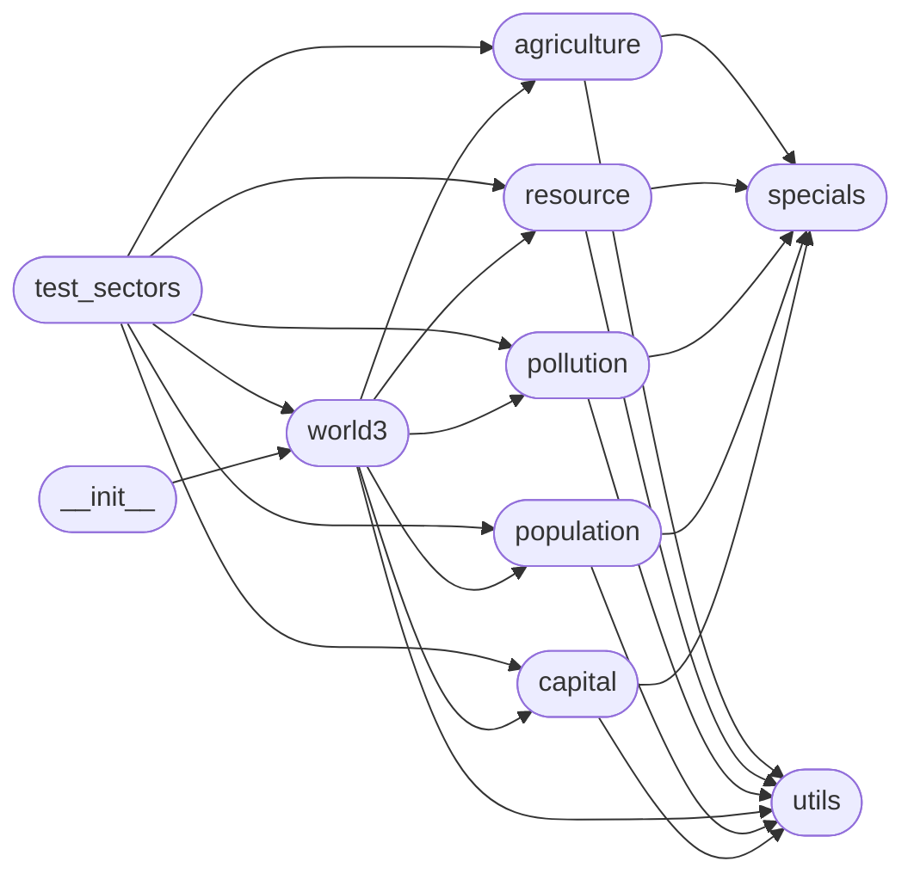

# Code Overview

[_Documentation generated by Documatic_](https://www.documatic.com)

<!---Documatic-section-Codebase Structure Python-start--->
## Codebase Structure Python

The codebase has a flat structure, with 10 code files.

<!---Documatic-block-system_architecture-start--->

<!---Documatic-block-system_architecture-end--->

# #
<!---Documatic-section-Codebase Structure Python-end--->

<!---Documatic-section-Key Objects-start--->
## Key Objects

There are exposed imports at level-0
from the source directory (pyworld3)

<!---Documatic-block-pyworld3-start--->

	
<code>pyworld3</code> (Click to Expand!)

* `pyworld3.world3.World3`
* `pyworld3.world3.hello_world3`

<!---Documatic-block-pyworld3-end--->

# #
<!---Documatic-section-Key Objects-end--->

<!---Documatic-section-Important Functions-start--->
## Important Functions

<!---Documatic-block-important_funcs-start--->
<!---Documatic-block-most_used_funcs-start--->
### Most Utilised Functions

* [pyworld3.specials.clip](4-pyworld3_specials.md#pyworld3.specials.clip) (5 times)
* [pyworld3.utils.requires](3-pyworld3_utils.md#pyworld3.utils.requires) (5 times)
* [pyworld3.specials.ramp](4-pyworld3_specials.md#pyworld3.specials.ramp) (1 times)
* [pyworld3.utils.plot_world_variables](3-pyworld3_utils.md#pyworld3.utils.plot_world_variables) (1 times)
* [pyworld3.specials.switch](4-pyworld3_specials.md#pyworld3.specials.switch) (1 times)
* [pyworld3.world3.hello_world3](5-pyworld3_world3.md#pyworld3.world3.hello_world3) (1 times)
<!---Documatic-block-most_used_funcs-end--->

<!---Documatic-block-end_user_funcs-start--->
### End User Exposed Functions

* pyworld3.world3.World3
* [pyworld3.world3.hello_world3](5-pyworld3_world3.md#pyworld3.world3.hello_world3)
<!---Documatic-block-end_user_funcs-end--->
<!---Documatic-block-important_funcs-end--->

# #
<!---Documatic-section-Important Functions-end--->

<!---Documatic-section-File IO-start--->
## File IO

<!---Documatic-block-file_io-start--->
The following files have file read operations

<!---Documatic-block-pyworld3-start--->

	
<code>pyworld3</code> (Click to Expand!)

* pyworld3.agriculture
* pyworld3.capital
* pyworld3.pollution
* pyworld3.population
* pyworld3.resource

<!---Documatic-block-pyworld3-end--->
<!---Documatic-block-file_io-end--->

# #
<!---Documatic-section-File IO-end--->

<!---Documatic-section-Class Hierarchy-start--->
## Class Hierarchy

<!---Documatic-block-pyworld3.agriculture.Agriculture-start--->

	
<code>pyworld3.agriculture.Agriculture</code> (Click to Expand!)

* pyworld3.world3.World3

<!---Documatic-block-pyworld3.agriculture.Agriculture-end--->

<!---Documatic-block-pyworld3.capital.Capital-start--->

	
<code>pyworld3.capital.Capital</code> (Click to Expand!)

* pyworld3.world3.World3

<!---Documatic-block-pyworld3.capital.Capital-end--->

<!---Documatic-block-pyworld3.pollution.Pollution-start--->

	
<code>pyworld3.pollution.Pollution</code> (Click to Expand!)

* pyworld3.world3.World3

<!---Documatic-block-pyworld3.pollution.Pollution-end--->

<!---Documatic-block-pyworld3.population.Population-start--->

	
<code>pyworld3.population.Population</code> (Click to Expand!)

* pyworld3.world3.World3

<!---Documatic-block-pyworld3.population.Population-end--->

<!---Documatic-block-pyworld3.resource.Resource-start--->

	
<code>pyworld3.resource.Resource</code> (Click to Expand!)

* pyworld3.world3.World3

<!---Documatic-block-pyworld3.resource.Resource-end--->

<!---Documatic-block-pyworld3.specials.Delay3-start--->

	
<code>pyworld3.specials.Delay3</code> (Click to Expand!)

* pyworld3.specials.Dlinf3

<!---Documatic-block-pyworld3.specials.Delay3-end--->

# #
<!---Documatic-section-Class Hierarchy-end--->

[_Documentation generated by Documatic_](https://www.documatic.com)