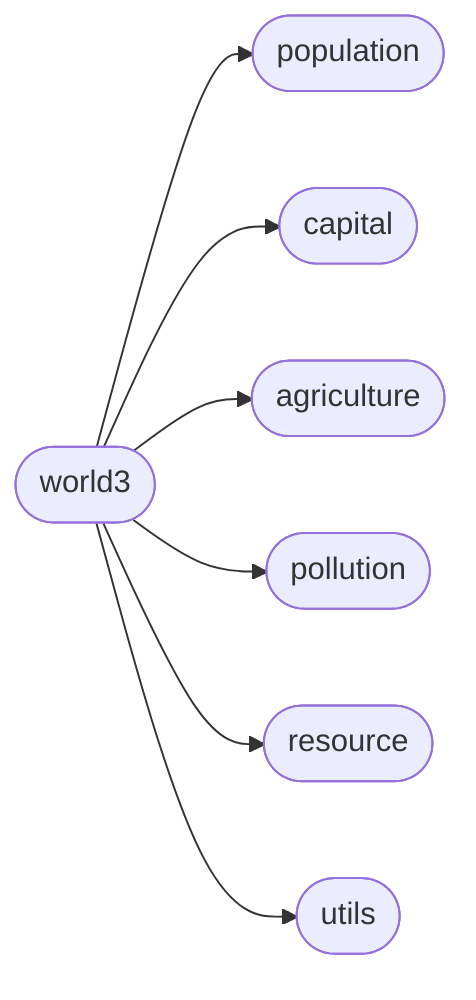
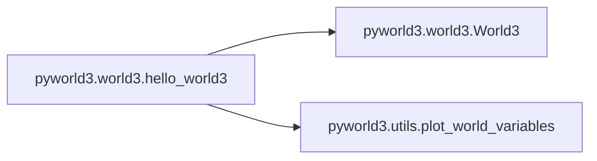

# Pyworld3 World3

[_Documentation generated by Documatic_](https://www.documatic.com)

<!---Documatic-section-Codebase Structure-start--->
## Codebase Structure

<!---Documatic-block-system_architecture-start--->

<!---Documatic-block-system_architecture-end--->

# #
<!---Documatic-section-Codebase Structure-end--->

<!---Documatic-section-pyworld3.world3.hello_world3-start--->
## [pyworld3.world3.hello_world3](5-pyworld3_world3.md#pyworld3.world3.hello_world3)

<!---Documatic-section-hello_world3-start--->


### Object Calls

* pyworld3.world3.World3
* [pyworld3.utils.plot_world_variables](3-pyworld3_utils.md#pyworld3.utils.plot_world_variables)

<!---Documatic-block-pyworld3.world3.hello_world3-start--->
<details>
	<summary><code>pyworld3.world3.hello_world3</code> code snippet</summary>

```python
def hello_world3():
    from .utils import plot_world_variables
    from matplotlib.pyplot import rcParams, show
    params = {'lines.linewidth': '3'}
    rcParams.update(params)
    world3 = World3()
    world3.init_world3_constants()
    world3.init_world3_variables()
    world3.set_world3_table_functions()
    world3.set_world3_delay_functions()
    world3.run_world3(fast=True)
    plot_world_variables(world3.time, [world3.nrfr, world3.iopc, world3.fpc, world3.pop, world3.ppolx], ['NRFR', 'IOPC', 'FPC', 'POP', 'PPOLX'], [[0, 1], [0, 1000.0], [0, 1000.0], [0, 16000000000.0], [0, 32]], figsize=(7, 5), grid=1, title='World3 standard run')
    show()
```
</details>
<!---Documatic-block-pyworld3.world3.hello_world3-end--->
<!---Documatic-section-hello_world3-end--->

# #
<!---Documatic-section-pyworld3.world3.hello_world3-end--->

[_Documentation generated by Documatic_](https://www.documatic.com)