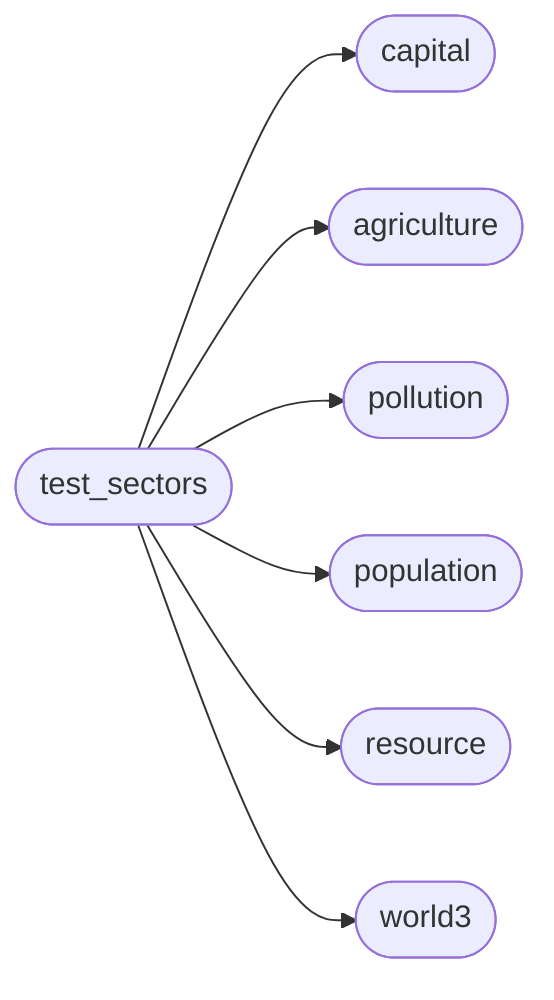

# Pyworld3 Test Sectors

[_Documentation generated by Documatic_](https://www.documatic.com)

<!---Documatic-section-Codebase Structure-start--->
## Codebase Structure

<!---Documatic-block-system_architecture-start--->

<!---Documatic-block-system_architecture-end--->

# #
<!---Documatic-section-Codebase Structure-end--->

<!---Documatic-section-pyworld3.test_sectors.test_population_sector-start--->
## pyworld3.test_sectors.test_population_sector

<!---Documatic-section-test_population_sector-start--->


### Object Calls

* pyworld3.population.Population

<!---Documatic-block-pyworld3.test_sectors.test_population_sector-start--->
<details>
	<summary><code>pyworld3.test_sectors.test_population_sector</code> code snippet</summary>

```python
def test_population_sector(significant_digits=10):
    pop = Population()
    pop.set_population_table_functions()
    pop.init_population_constants()
    pop.init_population_variables()
    pop.init_exogenous_inputs()
    pop.set_population_delay_functions()
    pop.run_population()
    vec_computed = [pop.p1[-1], pop.p2[-1], pop.p3[-1], pop.p4[-1], pop.le[-1], pop.tf[-1], pop.cbr[-1]]
    vec_reference = [1438726995.063073, 1652597018.7257755, 623934754.6756827, 304445848.4588078, 47.18320703555073, 5.00641642443415, 33.99945073141471]
    for (val_computed, val_reference) in zip(vec_computed, vec_reference):
        assert_approx_equal(val_computed, val_reference, significant=significant_digits)
```
</details>
<!---Documatic-block-pyworld3.test_sectors.test_population_sector-end--->
<!---Documatic-section-test_population_sector-end--->

# #
<!---Documatic-section-pyworld3.test_sectors.test_population_sector-end--->

<!---Documatic-section-pyworld3.test_sectors.test_capital_sector-start--->
## pyworld3.test_sectors.test_capital_sector

<!---Documatic-section-test_capital_sector-start--->


### Object Calls

* pyworld3.capital.Capital

<!---Documatic-block-pyworld3.test_sectors.test_capital_sector-start--->
<details>
	<summary><code>pyworld3.test_sectors.test_capital_sector</code> code snippet</summary>

```python
def test_capital_sector(significant_digits=10):
    cap = Capital()
    cap.set_capital_table_functions()
    cap.init_capital_variables()
    cap.init_capital_constants()
    cap.set_capital_delay_functions(method='euler')
    cap.init_exogenous_inputs()
    cap.run_capital()
    vec_computed = [cap.ic[-1], cap.sc[-1], cap.io[-1], cap.iopc[-1], cap.sopc[-1], cap.fioas[-1], cap.cuf[-1]]
    vec_reference = [8431442212986.304, 3807237555827.785, 2669956700778.996, 524.0346812127568, 747.2497656187999, 0.1268777273388647]
    for (val_computed, val_reference) in zip(vec_computed, vec_reference):
        assert_approx_equal(val_computed, val_reference, significant=significant_digits)
```
</details>
<!---Documatic-block-pyworld3.test_sectors.test_capital_sector-end--->
<!---Documatic-section-test_capital_sector-end--->

# #
<!---Documatic-section-pyworld3.test_sectors.test_capital_sector-end--->

<!---Documatic-section-pyworld3.test_sectors.test_agriculture_sector-start--->
## pyworld3.test_sectors.test_agriculture_sector

<!---Documatic-section-test_agriculture_sector-start--->


### Object Calls

* pyworld3.agriculture.Agriculture

<!---Documatic-block-pyworld3.test_sectors.test_agriculture_sector-start--->
<details>
	<summary><code>pyworld3.test_sectors.test_agriculture_sector</code> code snippet</summary>

```python
def test_agriculture_sector(significant_digits=10):
    agr = Agriculture()
    agr.set_agriculture_table_functions()
    agr.init_agriculture_variables()
    agr.init_agriculture_constants()
    agr.set_agriculture_delay_functions(method='euler')
    agr.init_exogenous_inputs()
    agr.run_agriculture()
    vec_computed = [agr.al[-1], agr.pal[-1], agr.uil[-1], agr.f[-1], agr.ly[-1], agr.aiph[-1]]
    vec_reference = [1395697595.027307, -125540117.14492828, 1455671094.280906, 198298271854.23358, 225.52103177280915, 22836.376251696394]
    for (val_computed, val_reference) in zip(vec_computed, vec_reference):
        assert_approx_equal(val_computed, val_reference, significant=significant_digits)
```
</details>
<!---Documatic-block-pyworld3.test_sectors.test_agriculture_sector-end--->
<!---Documatic-section-test_agriculture_sector-end--->

# #
<!---Documatic-section-pyworld3.test_sectors.test_agriculture_sector-end--->

<!---Documatic-section-pyworld3.test_sectors.test_pollution_sector-start--->
## pyworld3.test_sectors.test_pollution_sector

<!---Documatic-section-test_pollution_sector-start--->


### Object Calls

* pyworld3.pollution.Pollution

<!---Documatic-block-pyworld3.test_sectors.test_pollution_sector-start--->
<details>
	<summary><code>pyworld3.test_sectors.test_pollution_sector</code> code snippet</summary>

```python
def test_pollution_sector(significant_digits=10):
    pol = Pollution()
    pol.set_pollution_table_functions()
    pol.init_pollution_variables()
    pol.init_pollution_constants()
    pol.set_pollution_delay_functions(method='euler')
    pol.init_exogenous_inputs()
    pol.run_pollution()
    vec_computed = [pol.ppol[-1], pol.ppolx[-1], pol.ppgr[-1], pol.ppasr[-1]]
    vec_reference = [70318090645.31825, 517.0447841567518, 6309900000.0, 1547228900.9026806]
    for (val_computed, val_reference) in zip(vec_computed, vec_reference):
        assert_approx_equal(val_computed, val_reference, significant=significant_digits)
```
</details>
<!---Documatic-block-pyworld3.test_sectors.test_pollution_sector-end--->
<!---Documatic-section-test_pollution_sector-end--->

# #
<!---Documatic-section-pyworld3.test_sectors.test_pollution_sector-end--->

<!---Documatic-section-pyworld3.test_sectors.test_resource_sector-start--->
## pyworld3.test_sectors.test_resource_sector

<!---Documatic-section-test_resource_sector-start--->


### Object Calls

* pyworld3.resource.Resource

<!---Documatic-block-pyworld3.test_sectors.test_resource_sector-start--->
<details>
	<summary><code>pyworld3.test_sectors.test_resource_sector</code> code snippet</summary>

```python
def test_resource_sector(significant_digits=10):
    rsc = Resource()
    rsc.set_resource_table_functions()
    rsc.init_resource_variables()
    rsc.init_resource_constants()
    rsc.set_resource_delay_functions(method='euler')
    rsc.init_exogenous_inputs()
    rsc.run_resource()
    vec_computed = [rsc.nr[-1], rsc.nrur[-1], rsc.fcaor[-1]]
    vec_reference = [155436214735.18893, 190353997.60791045, 0.7891275705296221]
    for (val_computed, val_reference) in zip(vec_computed, vec_reference):
        assert_approx_equal(val_computed, val_reference, significant=significant_digits)
```
</details>
<!---Documatic-block-pyworld3.test_sectors.test_resource_sector-end--->
<!---Documatic-section-test_resource_sector-end--->

# #
<!---Documatic-section-pyworld3.test_sectors.test_resource_sector-end--->

<!---Documatic-section-pyworld3.test_sectors.test_world3_model-start--->
## pyworld3.test_sectors.test_world3_model

<!---Documatic-section-test_world3_model-start--->


### Object Calls

* pyworld3.world3.World3

<!---Documatic-block-pyworld3.test_sectors.test_world3_model-start--->
<details>
	<summary><code>pyworld3.test_sectors.test_world3_model</code> code snippet</summary>

```python
def test_world3_model(significant_digits=10):
    world3 = World3()
    world3.init_world3_constants()
    world3.init_world3_variables()
    world3.set_world3_delay_functions()
    world3.set_world3_table_functions()
    world3.run_world3(fast=False)
    vec_computed = [world3.pop[-1], world3.ppol[-1], world3.nr[-1], world3.io[-1], world3.al[-1]]
    vec_reference = [3976857676.148028, 81853646.6443053, 152023587005.39246, 42594878499.225685, 2420811800.6284337]
    for (val_computed, val_reference) in zip(vec_computed, vec_reference):
        assert_approx_equal(val_computed, val_reference, significant=significant_digits)
```
</details>
<!---Documatic-block-pyworld3.test_sectors.test_world3_model-end--->
<!---Documatic-section-test_world3_model-end--->

# #
<!---Documatic-section-pyworld3.test_sectors.test_world3_model-end--->

<!---Documatic-section-pyworld3.test_sectors.test_world3_fast_nocheck-start--->
## pyworld3.test_sectors.test_world3_fast_nocheck

<!---Documatic-section-test_world3_fast_nocheck-start--->


### Object Calls

* pyworld3.world3.World3

<!---Documatic-block-pyworld3.test_sectors.test_world3_fast_nocheck-start--->
<details>
	<summary><code>pyworld3.test_sectors.test_world3_fast_nocheck</code> code snippet</summary>

```python
def test_world3_fast_nocheck(significant_digits=10):
    world3 = World3()
    world3.init_world3_constants()
    world3.init_world3_variables()
    world3.set_world3_delay_functions()
    world3.set_world3_table_functions()
    world3.run_world3(fast=True)
    vec_computed = [world3.pop[-1], world3.ppol[-1], world3.nr[-1], world3.io[-1], world3.al[-1]]
    vec_reference = [3976857676.148028, 81853646.6443053, 152023587005.39246, 42594878499.225685, 2420811800.6284337]
    for (val_computed, val_reference) in zip(vec_computed, vec_reference):
        assert_approx_equal(val_computed, val_reference, significant=significant_digits)
```
</details>
<!---Documatic-block-pyworld3.test_sectors.test_world3_fast_nocheck-end--->
<!---Documatic-section-test_world3_fast_nocheck-end--->

# #
<!---Documatic-section-pyworld3.test_sectors.test_world3_fast_nocheck-end--->

[_Documentation generated by Documatic_](https://www.documatic.com)